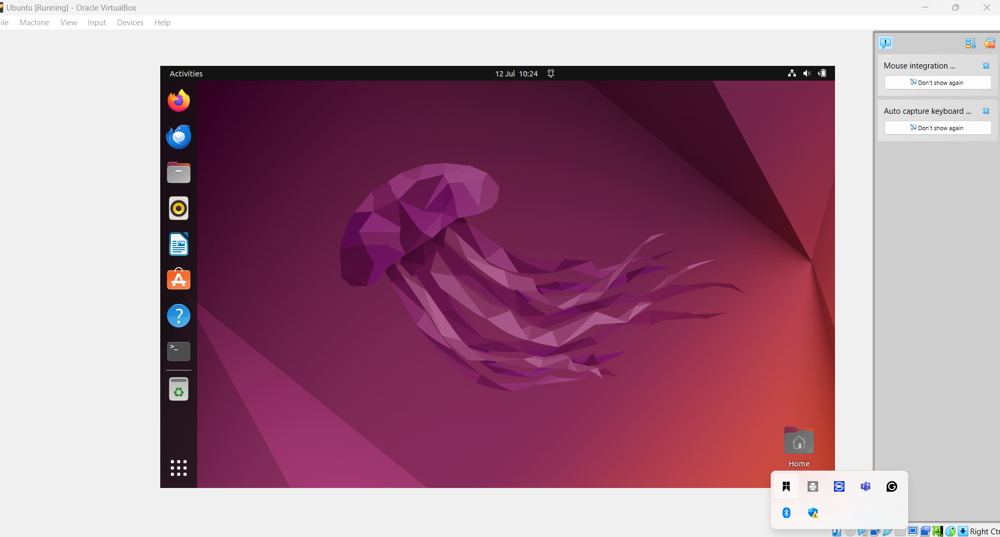

# Tech Environment Setup

## Introduction

This comprehensive installation guide is meticulously crafted to ensure a seamless setup of your development environment. It covers the installation of essential tools and libraries, including Python, Node.js, Docker. The project provides detailed instruction for installing essesntial software tools such as Git, Vsual Code(VScode),Virtualbox, etc,alongside necessary account creation like AWS and Github. Each section is designed to provide clear instructions and troubleshooting tips to help you get started quickly and efficiently.

## Project Pre-requisites

- Completion of Tech Environment Setup Course
- Internet Connection: Required for accessing cloud services, documentation, online repositories, and downloading necessary packages.
- Computer: Adequate performance to run virtual machines, containers (minimum 8GB RAM recommended), and development tools. 64-bit operating system or architecture is highly required.

## Tools needed to be installed

- Python: A versatile programming language used for various applications, including web development, data analysis, and automation.
- Visual Studio Code: A powerful, lightweight and versatile code editor developed by Microsoft, designed for  multiple programming languages and development task which provides a rich set of extensions for enhanced development experience.It offers features like intellisense for smart code completion , integrated Git support for seamless version control, and in-built terminal for command-line operations. Its vast extension marketplace allows users to customize the editor with themes, debuggers,language support, and additional features, making it a popular choice among developers.VScode is widely praised for the speed, flexibility, and extensive ecosystem of extensions it offers, making it a preferred choice for many developers.
- Git: A version control system that allows you to track changes in your code, collaborate with others, and manage your projects efficiently.
- VirtualBox : A free and open-source virtualization software that enables you to run multiple operating systems on a single machine, allowing for testing and development in different environments.
- Docker: A platform that enables you to develop, ship, and run applications in containers, ensuring consistency across different environments.
- Node.js: A JavaScript runtime that allows you to run JavaScript code on the server side, enabling the development of scalable network applications.
- Ubuntu on VirtualBox (Windows): A popular Linux distribution that provides a stable and secure environment for development and testing.
- Ubuntu on VirtualBox (Intel chip macOS): A popular Linux distribution that provides a stable and secure environment for development and testing.

- GitHub: A web-based platform for version control and collaboration, allowing you to host and manage your code repositories.
- Amazon Web Services (AWS): A comprehensive cloud computing platform that provides a wide range of services, including computing power, storage, and databases.
- Google Cloud Platform (GCP): A suite of cloud computing services that runs on the same infrastructure as Google's internal user products, offering scalable and reliable solutions for developers.
- Microsoft Azure: A cloud computing service created by Microsoft for building, testing, deploying, and managing applications and services through Microsoft-managed data centers.

## Installing Software Tool

As we must have completed the tech environmental setup videos, let's set up our tools on the computer.

## Visual Studio Code (VSCode)

Visual Studio Code (VSCode) is a powerful and versatile code editor that supports multiple programming languages and provides a rich set of extensions for enhanced development experience. Developed by Microsoft, it is available for free on all major operating systems, including Windows, macOS, and Linux. It offers features like Intellisense for code completion, debugging support, integrated terminal, and Git integration, making it a popular choice among developers. VSCode offers integrated Git support for seamless version control, a built-in terminal for command-line access, and a wide range of extensions to enhance functionality. It is highly customizable, allowing developers to tailor the editor to their specific needs and preferences. The extension marketplace allows users to customize the editor with themes, language support, and additional features. VSCode is widely used in the developer community due to its flexibility, ease of use, and extensive ecosystem of extensions.

## 1. Windows Installation

- Download VSCode: Go to the [Visual Studio Code download page](https://code.visualstudio.com/Download) and select the appropriate version for your operating system (Windows).

- On the web page, click on the download button for Windows. This will download the installer file, usually named VSCodeSetup.exe.

- Run Installer: Locate the downloaded exe file (usually in your Downloads folder) and double-click it to run the installer.

- Wizard: Click Next through the installation wizard. You can choose the default options or customize them as needed.

- Install: Lastly, click Install to begin the installation process. Once the installation is complete, click Finish to complete the installation.

- Launching VSCode: After installation, you can launch Visual Studio Code from the Start menu or by searching for Visual Studio Code in the search bar.

If your installation is successful, it will have a similar interface to the one shown below or slightly different but does not matter.

## 2. macOS Installation

- Download VSCode: Go to [Visual Studio Code download page](https://code.visualstudio.com/Download) and select the appropriate version for your operating system (macOS).

- On the web page, click on the download button for macOS if you are using an Apple laptop. This will download a zip file containing the Visual Studio Code application.

- Run Installer: Locate the downloaded zip file, double click to extract and open the VS Code application.

- Drag to Applications: Drag the Visual Studio Code application to the Applications folder. This will install Visual Studio Code on your macOS system.

- Launching VSCode: Navigate to the Applications folder, double-click on Visual Studio Code to open it. You can also search for Visual Studio Code using Spotlight (Cmd + Space) and launch it from there.

If your installation is successful, it will have the following look after launching. It might be slightly different but does not matter.

## Git

1. Windows Installation:
- Download Git: Go to the [Git download page](https://git-scm.com/download/win) and click on the download link for Windows. This will download the Git installer executable file.

- On the web page, click "Download" to download the Git Installer for Windows.

- Run Installer: Locate the downloaded .exe file, Double-click to run the installer.

- Options to check if prompted: Use Git from the Windows command prompt. "Use the Open SSL library." "Checkout as-is, commit as-is.""Use Windows' default console window".  During the installation, you will be prompted with several options. You can choose the default options or customize them as needed. Some important options include:
  - Choosing the default editor used by Git (e.g., Vim, Nano, Visual Studio Code).
  - Adjusting your PATH environment (recommended to use Git from the command line).

  - Configuring line ending conversions (recommended to use the default option).
- Install: Click Next through the installation wizard, and finally click Install to begin the installation process. Once the installation is complete, click Finish to complete the installation.

- Launching Git: After installation, you can launch Git Bash from the Start menu or by searching for "Git Bash" in the search bar. You can also use Git from the command prompt.

If your installation is successful, it will have a similar interface to the one shown below or slightly different but does not matter.

**Installation with homebrew on macOS**

- **Install Homebrew: Open Terminal, type the following and press "ENTER":
`/bin/bash -c "$(curl -fsSL https://raw.githubusercontent.com/Homebrew/install/HEAD/install.sh)"`

Note: If homebrew is already installed, please ignore above step

- Git installation: In the terminal, type the following command and press "ENTER":

`brew install git`

Launch Git: Open Terminal and type git --version  and press Enter to verify that Git has been installed. You should see the installed version of Git.

If your installation is successful, it will have a similar interface to the one shown below or slightly different but does not matter.

 
 - I dont use MacOS, so I cannot provide a screenshot of the terminal interface, but you can verify the installation by typing `git --version` in the terminal. If Git is installed correctly, it will display the version number.

 

Note: Other methods to install Git on macOS can be found here: [Git for macOS](https://git-scm.com/download/mac)

## VirtualBox
1. Windows Installation:

- Download Virtual box:Go to Oracle virtual box website [VirtualBox download page](https://www.virtualbox.org/wiki/Downloads) and click on the link for Windows hosts. This will download the VirtualBox installer executable file.

 

- On the web page, Click "Downloads" and select the Windows host version.
- Run Installer:exe file, double-click to run the installer.

- Wizard: Click "Next" through the installation wizard. Click next to all the remaining prompt, leave every option to "default". You can choose the default options or customize them as needed.

- Install Virtual Box: Lastly,click "Install" to begin the installation process. Once the installation is complete, click "Finish" to complete the installation.

- Launching VirtualBox: After installation, you can launch VirtualBox from the Start menu or by searching for "VirtualBox" in the search bar.

If your installation is successful, it will have a similar interface to the one shown below or slightly different but does not matter.

 

2. **macOS Installation**: This is applicable if you are using recent macOS(Intel Processsor chip), NOT applicable to older macOS (M1 processor chip)

## I do not use MacOS so images are not available for this section, but the steps are similar to the Windows installation.

 - Download Virtual box: Go to Oracle virtual box website [VirtualBox download page](https://www.virtualbox.org/wiki/Downloads) and click on the link for OS X hosts. This will download the VirtualBox installer package file.

  - On the web page, click "Downloads" and select the macOS host version.

   

- **Run Installer**: Locate the downloaded .dmg file (usually in your Downloads folder), double-click to open the virtualbox installer or double-click the VirtualBox.pkg file to run the installer.

 - **Install Virtual Box**:  Double click on the package file inside the .dmg, follow the on-screen instructions to complete the installation. Follow the installation prompts. You may need to allow the installation in your System Preferences under Security & Privacy if prompted.

 - Security warning: If you encounter a security warning about the installation being blocked, go to "System Preferences" > "Security & Privacy" and click "Allow" next to the message about VirtualBox.

 - System Preferences: After installation, you may need to go to System Preferences and go to Security & Privacy. Click the lock icon to make changes and enter your password. Allow the Oracle Corporation system software to load.

- Launching VirtualBox: After installation, you can launch VirtualBox from the Applications folder or by searching for "VirtualBox" using Spotlight (Cmd + Space).

 If the installation is successful, it will have a similar interface to the one shown below or slightly different but does not matter.

 

 ## Ubuntu on(Linux Distros) on VirtualBox (Windows Host) **

  -Download Ubuntu Desktop ISO file: Go to **Ubuntu official website** [Ubuntu download page](https://ubuntu.com/download/desktop) and click on the download button for the latest version of Ubuntu Desktop. This will download the Ubuntu ISO file.

   

   - **Virtual Box**: Launch your already installed virtual box.

- **Create a New Virtual Box Machine (VM)**, click on NEW or Plus symbol at the top left hand side of the virtual box machine.

 - **Configure the Virtual Machine:** Choose Linux as the type, and Ubuntu as the version. Allocate at least 2GB of RAM (4GB recommended) and create a virtual hard disk (VDI) with at least 20GB of storage.

  - **Create aVirtual Hard Disk:** Choose "Create a virtual hard disk now" and click "Create". Select "VDI (VirtualBox Disk Image)" as the hard disk file type and click "Next". Choose "Dynamically allocated" for storage on physical hard disk and click "Next". Set the size of the virtual hard disk (at least 20GB recommended) and click "Create".

- **File Location and size:** Choose a location to save the virtual machine files and set the size of the virtual hard disk (at least 20GB recommended). Click "Create" to create the virtual machine.

 - **Select an installation file** : Choose the ubuntu .ISO file that you downloaded from ubuntu website.

- **Start the Virtual Machine:** Click on the "Start" button (green arrow) to boot the virtual machine. It will boot from the Ubuntu ISO file.

 - **Install Ubuntu:** Follow the on-screen instructions to install Ubuntu. Choose your language, keyboard layout, and installation type (e.g., "Erase disk and install Ubuntu" for a fresh installation). Set up your user account and password.

  - **Complete Installation**: Remove the installation media when prompted, then power off the virtual machine, and ubuntu will boot to desktop as shown below, then you can  enter the login credentials you created during installation.

   

   ## Ubuntu (Linux Distros) on Virtual box (Mac Host) I do not use MacOS so images are not available for this section, but the steps are similar to the Windows installation.

- Download Ubuntu Desktop ISO file: Go to **Ubuntu official website** [Ubuntu download page](https://ubuntu.com/download/desktop) and click on the download button for the latest version of Ubuntu Desktop. This will download the Ubuntu ISO file.

 

 - **Virtual Box**: Launch your already installed virtual box.

 - **Create a New Virtual Box Machine (VM)**, click on NEW or Plus symbol at the top left hand side of the virtual box machine.

 - **Configure the Virtual Machine:** Choose Linux as the type, and Ubuntu as the version. Allocate at least 2GB of RAM (4GB recommended) and create a virtual hard disk (VDI) with at least 20GB of storage.

 - **Create a Virtual Hard Disk:** Choose "Create a virtual hard disk now" and click "Create". Select "VDI (VirtualBox Disk Image)" as the hard disk file type and click "Next". Choose "Dynamically allocated" for storage on physical hard disk and click "Next". Set the size of the virtual hard disk (at least 20GB recommended) and click "Create".

 - **File Location and size:** Choose a location to save the virtual machine files and set the size of the virtual hard disk (at least 20GB recommended). Click "Create" to create the virtual machine.

- **Mount Ubuntu ISO:** Select the newly created virtual machine, click on "Settings" (gear icon), go to the "Storage" tab, and click on the empty CD/DVD drive. Click on the CD icon next to "Optical Drive" and select "Choose a disk file". Locate and select the downloaded Ubuntu ISO file.

- **Start the Virtual Machine:** Click on the "Start" button (green arrow) to boot the virtual machine to install Ubuntu. It will boot from the Ubuntu ISO file.

- **Install Ubuntu:** Follow the on-screen instructions to install Ubuntu. Follow the installation wizard, configuring options such as time zone, keyboard layout , and user account. Choose your language, keyboard layout, and installation type (e.g., "Erase disk and install Ubuntu" for a fresh installation). Set up your user account and password.

- **Complete Installation:** Once the installation is complete, click "Restart Now". After reboot, you may need to press Enter to boot from the virtual hard disk. Ubuntu will boot to desktop as shown belo, then you can enter the login credentials you created during installation. The interface might be slightly different from this based on the version you downloaded.

 

 ## Possible Error you may encounter and Link to resolution youtube video:

 - When virtualization is not enabled: click.here

  - C++ redistributable error:click here

   ## Creating Github and AWS Account

   Please note that account creation has nothing to do with the type of OS that you use, since you are dealing with third-party website

   **Github Account**
    
- Visit the GitHub website: Open your web browser and go to **GitHub's website**.

 

 -**Sign Up: On the GitHub homepage, you will find a "Sign up" button. Click on it.

 Enter Your Information:Fill out the required information on the sign up page. This typically includes your username, emailaddress, and password. Choose a strong and secure password.

- **Verify Your Email:** After entering your information, GitHub will ask you to verify your account by solving a puzzle or confirming your email address. Check your email inbox for a verification message from Github and click on the verification link and follow the instructions provided.

- **Complete the CAPTCHA: Profile:**
GitHub may ask you to complete a CAPTCHA to ensure that you are not a robot. Follow the instructions to prove you are a human.  Verifying your email, you may be prompted to complete your profile by adding a profile picture and bio. This step is optional.

- **Choose a Plan:** GitHub offers both free and paid plans.Github offers free plans for public repositories and paid plans for private repositories. Choose the plan the best suit your needs. For beginners , the free plan is usually sufficient. For most users, the free plan is sufficient. You can choose the free plan and click "Continue".

- **Complete the Sign Up:** After choosing a plan, click on the "Create account" button to complete the sign-up process.

- **Tailor Your experience (Optional):** GitHub may ask you a few questions to tailor your experience. You can answer these questions or skip them.GitHub may ask you to answer a few questions to tailor your experience. You can answer these questions or skip them.

- **Welcome to GitHub:** Once you have completed the sign-up process, you will be taken to your GitHub dashboard. You can now start creating repositories, collaborating on projects, and exploring the GitHub community.Congratulations! you have Github account.

- **Explore GitHub:** You can now explore GitHub platform. Familiarize yourself with the interface, and you can start by creating a new repository if you have a project in mind. Create repositories and start collaborating on projects. You can also customize your profile and settings as needed.

**Amazon Web Services (AWS) Account**

- **Visit the AWS Free Tier website:** Open your web browser and go to the [AWS website](https://aws.amazon.com/).Go to the AWS Free Tier page at AWS Website to learn about the services available in the free tier and start the signup process.

- **Click on "Create a Free Account":** On the AWS Free Tier page, click on the "Create a Free Account" button. This will take you to the account creation page.

Sign in or create a new Amazon account: if you already have an Amazon account, you can sign in using your existing credentials. If not, click on "Create a new AWS account" to create a new account.

- **Provide Account Information:** Fill out the required information, including your email address, password, payment details and AWS account name. Note that you will be required to provide valid credit card information, even though you wont be charged unless you exceed the free tier limits. You will be required a minimum of 1 usd in your card.Choose a strong password and click "Continue".

- **Note**: Please note that if you are from Africa country, virtual dollar cards will serve you better. Most regular card will not work.

- **Verify Your Identity:** AWS will ask you to verify your identity by providing a phone number. You will receive a verification code via SMS or voice call. Enter the code to verify your identity.

- **Select a Support Plan:** AWS offers different support plans, including Basic (free), Developer, Business, and Enterprise. For most users, the Basic support plan is sufficient. Select the Basic support plan and click "Continue".

- **Enter payment information:** Enter your payment information, including credit card details. AWS requires a valid credit card to create an account, but you won't be charged unless you exceed the free tier limits. Click "Continue" after entering your payment information. AWS uses this for identity verification and to prevent abuse of the three tier resources.

- **Review and Complete:** Review your account information and click "Create Account and Continue" to complete the account creation process.

 - **Wait for approval**: It might take a short while for your account to be approved.Once approved, you will receive a confirmation email.

 - **Access the AWS Management Console:** After your account is created, you can access the AWS Management Console by going to [AWS Management Console](https://aws.amazon.com/console/). Sign in using your email address and password.

- **Explore AWS Services:** Once you are logged in, you can explore the various AWS services available in the free tier. You can start using services like Amazon EC2 (Elastic Compute Cloud), Amazon S3 (Simple Storage Service), and more without incurring any charges as long as you stay within the free tier limits. Make sure to explore and understand the limitations of the free tier to avoid unexpected charges.

