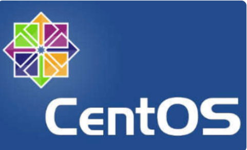
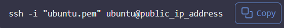

# Introduction to Linux

In the dynamic landscape of technology, mastering the fundermentals is essential for anyone aspiring to excel in fields such as DevOps, Cloud Computing, Software Development, Cybersecurity, Data Analysis/Science, AI, and QA Testing. This project is designed to equip you with a solid foundation in Linux. Understanding the tech from the basics lays the groundwork for success in various tech-centric careers.

## What is Linux?

Linux is a free, open-source operating system similar to Windows or macOS, but it's more widely used for servers and supercomputers. It's known for its stability, security, and flexibility, allowing users to modify and distribute their versions. Linux runs a wide range of devices, from desktops to smartphones, and powers much of the internet's infrastructure. It's supported by a global community of developers who contribute to it's many distributions, each tailored for specific needs or preferences.

## Linux Distributions

Linux distributions, often referred to as distros, are different versions or flavours of the Linux operating system, built using Linux kernel, each with its own features, package management systems, and user interfaces. These distros package the Linux kernel with various software applications, libraries, and tools to provide a functional computing environment. They offer different configurations, desktop environment, package managers, and software repositories, and then they are branded.     Some popular Linux distributions include:

- **Ubuntu**: User-friendly, suitable for beginners, and widely used for desktops and servers. It is one of the most widely recognized Linux distributions, known for its user-friendliness and ease of installation. It's an excellent choice for those new to Linux, as well for everyday desktop computing. Ubuntu has server editions for web hosting and cloud computing, making it a versatile choice for both personal and professional

- **CentOS** CentOS is favoured in enterprise and server environments due to its stability and long-term support. It is based on the sources of Red Hat Enterprise Linux (RHEL) and is often used in production environments where reliability is crucial. CentOS provides a robust platform for web servers, databases, and other critical applications, making it a popular choice among system administrators.

- **Debian**: Debian is also known for its to free and open-source software principles. Makes Linux available for free, provides a wide range of software packages and supports multiple hardware archtectures. Debian is the foundation for many other distributions, including Ubuntu, and is known for its stability and security. It is often used in server environments and is a popular choice for developers who want a reliable and customizable Linux experience

- **Fedora**: Fedora is a cutting-edge distribution that showcases the latest features and technologies in the Linux ecosystem. It is known for its rapid release cycle and is often used by developers and enthusiasts who want to stay on the bleeding edge of Linux development. Fedora serves as a testing ground for new features that may eventually be included in Red Hat Enterprise Linux (RHEL).

## Installation and Initial Setup ##

In this section we will create a server in the cloud, and gain access to it from local environment. When we say loacal environment, we mean your personal computer, which can be a Windows, MacOS or Linux machine. We will use the cloud provider DigitalOcean to create our server. DigitalOcean is a popular cloud provider that offers virtual private servers (VPS) and other cloud services. It is known for its simplicity, ease of use, and competitive pricing.

The setup will look like this

We will use AWS, a public cloud  provider to create the server in the cloud. For now, we will use the free tier of AWS, which allows us to create a server for free for a limited time. We will use the AWS Management Console to create our server. The AWS Management Console is a web-based interface that allows us to manage our AWS resources. We will use the AWS Management Console to create an EC2 instance, which is a virtual server in the cloud. 
Right now, all you need to know is that AWS is a cloud provider that allows us to create virtual servers in the cloud. We will use AWS to create our server in the cloud, and we will use SSH to connect to our server from our local environment. The free virtual server is called EC2 Elastic Compute Cloud.

## Let us create an EC2 instance. i.e a Linux Server

You can either Watch the videos below to get yourself set up.

- ## AWS account setup and provisioning an Ubuntu Server

- ## Connecting to your EC2 instance using SSH

Or follow the guideline below.

- **i. Register a new AWS account account following this instruction.**

- **ii. Sign into your AWS account** and navigate to the EC2 Dashboard.**

- **iii. Launch a new EC2 instance** by clicking on the "Launch Instance" button.

- **iv. From the menu on the left side, select "Instances" and then click on the "Launch Instance" button.**

- **v. Select launch instance on the top right side of the page.**

- **vi. Follow the image below to finish launching an instance.**

## Connecting to the server

Now it's time to get onto the server you have just created in the cloud. You will need a number of things setup depending on your operating system.

1. **A client tool** : A client tool is a program on your computer that lets you communicate and give commands to a remote server. Imagine it as a doorway on your laptop that allows you to speak to a far-off computer as if it were right in front of you. By typing commands into the terminal, you can ask the remote server to perform tasks, retrieve data, or even run programs, all without being physically present near the server. This is especially useful for managing websites, running software, or assessing files from anywhere in the world, just by using simple text commands.

2. **A secure protocol** : A secure protocol is like a secret language that keeps your conversations with the remote server private and safe. When you use a secure protocol, it scrambles your messages so that only you and the server can understand them. This prevents anyone else from eavesdropping or tampering with your communication, ensuring that your data remains confidential and secure. it is a protected path over the internet that allows you to send and receive information without anyone else being able to read or change it. This is especially important when you're working with sensitive data, like passwords or personal information, as it helps keep your online activities safe from prying eyes. Imagine sending a secret letter through a series of locked, armored vehicles instaed of a regular open road; thats what a secure protocol does for your data. It encrypts, or scrambles your information so that only the intended recipient, the remote server, can understand it. The popular protocol for this purpose is called **SSH (Secure Shell).** SSH is like a secure tunnel that connects your computer to the remote server, allowing you to send commands and receive responses safely.

# Client Tools to Install

If you are on windows, you will need to have tools such as **MobaXterm** installed. There are many other options such as:
- **PuTTY**

- **Git Bash** which is available by default when you install Git on

- **PowerShell** which is available by default on Windows 10 and later versions.. Even though you can use it to access Linux computers remotely, it is more optimised for Microsoft Windows.

For simplicity, you should focus only on **MobaXterm** which is perfect for all you need throughout this program.

## There will be no picture represented here as i do not use MacOS

For MacOS users, client terminal is already available so you dont have to do anything. Simply open up the terminal by navigating to the Application folder --> Open up the Utilities folder --> And "locate Terminal"

**Coonecting using SSH**
Now that you have the terminal open, it is time to coonect to the remote server you created earlier.

Most client tools already have SSH installed, so you literally dont have to do anything other than simply typing the command "ssh"on the terminal.
1. Open up the terminal

2. Locate "**pem key** you downloaded when you provisioned the cloud server.

- Assuming it got downloaded in the 'Downloads" folder

- UseLinux command to navigate into the folder

Lets quickly breakdown this command:

- "**cd**": Stands for "Change Directory", which is a command used to navigate between folders in the terminal.

- "**~**" Represents the home directory of the current user. Its a shortcut to refer to the user's primary directory without having to type out the full path.

- `/Downloads`: Specifies the Downloads folder, which is a common directory where files are saved when downloaded from the internet

3. Assuming that the name of the pem key is `ubuntu.pem`. You can run `ls -l` command and it will show you the list of files in the "Downloads" folder, and you should be able to see your "ubuntu.pem"file listed in there.

4. Extract the public IP address of the server you created from AWS

5. Connecting to the server using SSH. Simply run the command below.

Letsbreak down the command:

`ssh`:This is the command to initiate an SSH connection. SSH is a protocol used to securelyaccess and manage a remote system over an unsecred network (The internet is an unsecured network).

`-i @ubuntu.pem": The -i option specifies the path to a private key file used for authentication. In this case, "ubuntu.pem" is the private key file. This file is essential for proving your identity to the server without needing a password.The.pem file is often used when the connection to the server, for example, those hosted on AWS(Amazon Web Services.)

`ubuntu@public_ip_address`:This part specifies the user and the server you're trying to connect to. `ubuntu`is the username on the remote server that you're logging in as, and **`public_ip_address`** should be replaced with the actual public IP address(hostname) of the server you are trying to access. The`@` symbol separates the username from the server' address.

Once you establish a successful connection, you should see an output like the below which proves that you have successfully connected to your remote server.

# **Package Managers**
Most of the time, when working on linux, there will be the need to install tools. Think about it, the servers are used to host websites, and there has to be a tool that will help in the rendering of the web pages. A commonly used tool is called"**Ngix**"

Since the servers are not your regular computers where you can go to a browser to click and download, there is the need to have package managers that can help achieve this.

Package managers in Linux are tools that automate the process of installing, updating, configuring, and removing software packages on a Linux server. They simplify the management of software by handling dependencies, versioning, and installation procedures. There are several package managers used in various Linux distributions.

** Commonly Used Package Managers APT(Advanced Package Tool)**:

Used by Debian- based distributions such as Debian, Ubuntu, and derivatives. Commands include **`apt-get`** and **`apt`**. You will get to use this a lot very soon.

**YUM (Yellowdog Updater Modified)**: Originally used by Red Hat and CentOS, **`YUM`** is now largely replaced by `**dnf**` in modern Red Hat based distributions. It simplifies package management by resolving dependencies just like `apt`.

**DNF**(**Dandified YUM**):Used in modern versions of Red Hat based distributions as a replacement for YUM. It provides improved performance and resolves some of the limitations of the older YUM tool.

**Installing, Updating, and Removing Software**

Since we are already on an Ubuntu based server, lets explore how to install on linux server.

1.**UpdatingPackage Lists**: Before installing new software or updating existing packages, its important to refresh the package lists.

Note: Ignore `sudo` for now. We will explain that soon.

2.**Installing Software Packages**

Lets try to install a command called **`tree`**

The **tree** command is commonly used to visually see the file system structure on a linux server. So let's install it with the command below.

Debian/Debian

If you were on other Linux distribution using **`yum`**, the command would look like this.

Red Hat/Fedora

Install Package

3.**Verifying Installed Packages**: To confirm that the desired package or software has been successfully installed, simply run the **`tree`** command, and specify the path you want to see the tree structure.

For example:

Play around with this tree tool and specify different folders on the server.

4.**Updating Installed Packages** Keep your system up-to-date by updating installed packages.

5. **Removing Software Package** : To remove the **tree** package we installed earlier, run the below command

 

