# Mini Project- Basic Linux Commands
# Linux Commands Deep Dive
## Now that you have a client terminal and have accessed your remote server, what next?

For the next couple of projects, you will learn a lot about Linux commands, therefore its time to get your hands dirty.

## What is a Linux Command?

A Linux command refers to a program or utility that runs in the command-line interface (CLI). The CLI is a text based environment where you interact with the system by typing commands. Linux commands can perform a wide range of tasks, such as file manipulation, system monitoring, and network configuration.

Linux commands are executed by entering text in the Terminal and pressing enter. Each command typically consists of the command name followed by options and arguments. Options modify the behavior of the command, while arguments specify the target of the command.These commands enable you perform a wide range of tasks,including installing software, managing files and directories, monitoring system performance, and configuring network settings.

The general syntax of a Linux command is as follows: (Try the commands used as example as you read along

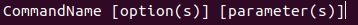

A command  may consist of options and parameters, but they are not always required. Options are usually preceded by a hyphen (-) or double hyphen (--), and they modify the behavior of the command. Parameters are the targets of the command, such as files or directories.

## Command Name
 This represents the action or tasks you want to perform. For example, `ls` is a command that lists files and directories in the current directory.

## Options or Flags
Options or flags are additional parameters that modify the behaviour of the command. They are usually preceded by a hyphen (-) or double hyphen (--). For example, `-l` is an option for the `ls` command that provides a detailed listing of files and directories. For example, if i want to show extra information about the files and directories, I can use the `-l` option with the `ls` command like this: 'ls -l'

## Arguments or Parameters

Arguments or parameters are the targets of the command, such as files or directories. They specify what the command should operate on. For example, in the command `ls /home/user`, `/home/user` is an argument that specifies the directory to list. A parameter provides specific information to the command about what it should act upon. or A parameter provides information or data required by the command to execute the desired action. For example, if i want to create a new directory (or folder), i will use the 'mkdir' command. The parameter will be the name of the directory in which i will pass to it. For example, to create a directory named "myfolder", I would use the command `mkdir myfolder`.'mkdir photos' will create a **photos** directory.

It's important to note that Linux commands are caser-sensitive, meaning that `ls` and `LS` are treated as different commands. Additionally, many commands have multiple options and parameters that can be combined to achieve specific tasks.You need to them exactly as they are spelled and formatted.

## Manipulating files and directories on Linux

Most of the time, you will be working with files and directories on your Linux system. Hence, it is very important to know how to work with them. In the next section, we will focus on different commands that covers different use cases of manipulating files and directories on linux.

The **'sudo'** command

In Linux, some actions need special permissions to execute. The `sudo` command allows you to run commands with elevated privileges, typically as the superuser (root). This is necessary for tasks that require administrative access, such as installing software or modifying system files or changing important system settings. This is where the sudo command comes into play."sudo" stands for "superuser do," and it allows you to execute commands with elevated privileges. When you prefix a command with `sudo`, you are temporarily granting yourself superuser access to perform administrative tasks.

**Why Use Sudo?**

**Security:** Using `sudo` helps protect your system by requiring explicit permission for potentially dangerous commands. It prevents unauthorized users from making changes that could harm the system.
It helps in keeping the system secure by limiting access to powerful commands. Only users with the necessary permissions can use `sudo`, reducing the risk of accidental or malicious changes to the system.

**Accountability/ Tracking:** When you use `sudo`, your actions are logged, providing a record of who performed administrative tasks. This is important for auditing and troubleshooting.

**Temporary Access:** `sudo` grants temporary superuser access, allowing you to perform administrative tasks without permanently logging in as the root user. This minimizes the risk of accidental changes to critical system files.

When you run a command with `sudo`, the system checks your user account against the `/etc/sudoers` file to determine if you have permission to execute that command. If you do, you may be prompted to enter your password for authentication. Once authenticated, the command runs with elevated privileges.

**How Sudo Works**:

When you precede a command with sudo, Linux asks for your password. Once you enter it correctly, you can run commands as if you were the root user. for a short period of time, usually 15 minutes, you won't need to enter your password again for subsequent sudo commands.

** Creating a folder with sudo:**

Sometimes, you need superiser privileges to create a folder in certain directories, such as system directories. In such cases, you can use the `sudo` command to create a folder with elevated privileges. Here is how you can do it:

1. Open your terminal, and connect to your linux server using SSH.

2. Try creating a folder in a restricted location. let's try to create a folder named **"example"** in in the /root directory which is reserved for the root user:

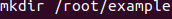

3. Observe the error message indicating that you do not have permission to create a folder in the /root directory.

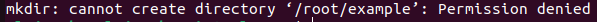

This error occurs because the /root directory is owned by the root user, and regular users do not have permission to create folders there. As a regular user you donot have the necessary permissions to create directories in /'root'.

4. Use sudo to successfully create a folder in the /root directory:

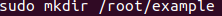

**Press Enter :** Because you now included '*sudo*' before the command, you will be prompted to enter your password. Type your password and press Enter.It will execute successfully without any error message. In some cases, you may be prompted to provide a password. If it does, and you know the password, simply provide it and the elevated permission will be used to create the folder.

**Verify the folder's creation:** The command should succeed without errors. You can check the folder's existence by listing the contents of'/root' using the **'ls'** command.It should indicate that the folder named **"example"** has been created successfully.Though you may need to use sudo to list the contents of the /root directory as well, since it is a restricted area.

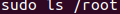

**Note:** Using sudo gives you significant power over your system, including the ability to change or delete crucial systems files. So, its wise to use it carefully and only when necessary.

**Pwd command**

Use the '**pwd**' command to find the path of your current working directory. This command stands for "print working directory" and displays the full path of the directory you are currently in.Simply type `pwd` in the terminal and press Enter. The output will show you the absolute path of your current directory.Simply entering 'pwd' will return the full current path- a path of all directories that starts with a forward slash (/). For example, '/home/username'.

The 'pwd' command uses the following syntax:

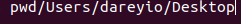 

Linux directory structure is hierarchical, starting from the root directory (/) at the top. The path returned by `pwd` shows the hierarchy of directories leading to your current location.

After learning about the use of sudo, its crucial to understand how the linux filesystem is organized. This knowledge is fundermental when navigating through the system, managing files, and understanding where different types of files and directories reside.

The Root Directory (/)

At the top of the Linux filesystem hierarchy is the root directory, represented by a single forward slash (/). All other directories and files are organized beneath this root directory. The root directory contains essential system directories and files that are critical for the operation of the Linux system.Unlike windows, which uses different drives('C:', 'D:', etc.), Linux uses a single unified filesystem structure where all files and directories are organized under the root directory.Linux organizes everything starting from this root directory. Under'/', you will find various directories with specific purposes:

**/bin/**: Essential user command binaries(programs) that need to be available to all users are stored here(e.g.,ls,cp). /*etc:**: Configuration files for the system and applications are stored here. These files control the behavior of various system components and applications.

**/home/**: This directory contains user-specific directories. Each user has their own subdirectory under /home, where personal files and settings are stored (e.g., /home/username).Personal directories for users. /root:Th home directory for the root user./**var/**: Variable data files, such as logs, databases, and temporary files, are stored here. This directory is used for files that change frequently during system operation.**/usr/**: It contains majority of user utilities and applications. User programs and data are stored here. It contains subdirectories like /usr/bin for user commands, /usr/lib for libraries, and /usr/share for shared data.

You should use the **ls** command to list the contents of the root directory. This will give you an overview of the directories and files present at the top level of the filesystem.'

**'cd'** command

To navigate through the Linux filesystem, you use the `cd` command, which stands for "change directory." This command allows you to move between directories in the filesystem. Let's say we want to navigate to the root filesystem on your server. Remember, the root filesystem is like the "C:" drive in Windows, where all the files and directories are organized. It is the starting point of folders and it is represented by '/' on Linux. To go to the root filesystem, simply type;

To confirm that you are there, use the **pwd** command to check where you are.

To list the files and directories on in the root filesystem, simply type **'sudo ls -l'**.

Below is my output, but yours may be slightly different depending on your system configuration:

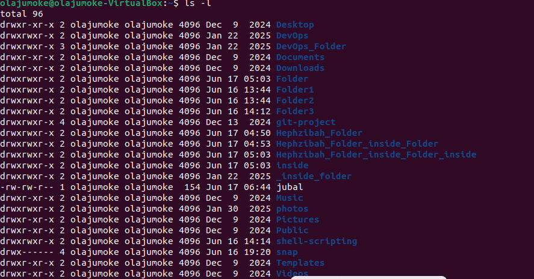

If i want to navigate to the home directory, which is where user-specific files are stored, I can use the `cd` command followed by the path to the home directory. The home directory is typically located at `/home/username`, where "username" is your actual username on the system. If i want to navigate to any of the directories in the output, lets say the 'usr', then i can use the 'usr', then i can use the 'cd' command to enter that directory.

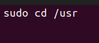

Notice that the 'usr' has a '/' prefix. On Linux, navigation starts from the root.

**Side Hustle Task 1**

ls command

The **'ls'** command lists files and directories. Running it without a flag or parameter will show the current working directory's contents. To see more details, you can use the `-l` flag, which provides a long listing format with additional information such as file permissions, ownership, size, and modification date.

To see other directories' content, type 'ls' followed by the desired path. For example, to view files in the Documents folder, enter:
**ls /home/username/Documents** or simply 'ls Documents' if you are already in the home directory or ls/home/ubuntu/Documents

Here are some options you can use with the `ls` command:
| Option | Description |

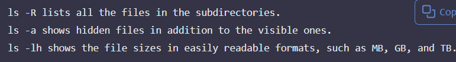

**cat command**

The **'cat'** command is used to display the contents of a file in the terminal. It can also be used to concatenate multiple files into one. 'Concatenate' means to join or combine files together. The `cat` command reads the contents of a file and outputs it to the terminal, allowing you to view the file's content without opening it in an editor.It's one of the most frequently used Linux commands. It lists, combines, and writes file content to the standard output (usually the terminal console). The name "cat" is short for "concatenate," which means to join or combine files together.To run the **'cat'** command, type cat followed by the name of the file you want to display and its extension. For example: 

Displays the content of **'os-release'** file in the **'/etc/'** directory. The **'os-release'** file contains information about the operating system, such as its name, version, and other details.

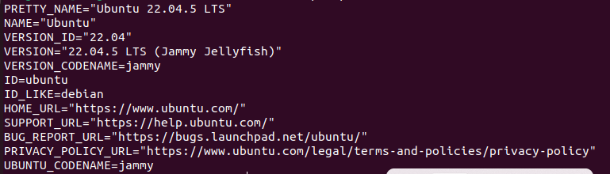

**cp command**

Use the **'cp'** command to copy files and directories and their contents. The syntax is `cp [options] source destination`. For example, to copy a file named **'example.txt'** from the current directory to a directory named **'backup'**, you would use:**cp example.txt backup/** 

To copy one file from current directory to another, enter **cp** followed by the file name and the destination directory. For example:

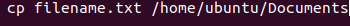

**cp filename.txt /home/ubuntu/Documents**
This command copies the file **'filename.txt'** from the current directory to the **'/home/ubuntu/Documents'** directory. If you want to copy a directory and its contents, you can use the `-r` option (recursive) like this: `cp -r source_directory destination_directory`.

To copy multiple files to a directory, you can specify the files followed by the destination directory. For example: `cp file1.txt file2.txt /home/ubuntu/Documents/`

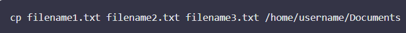

To copy the content of a file to a new file in the same directory, enter **'cp'** followed by the source file and the destination file:

To copy an entire directory, pass the -R flag before typing the source directory, followed by the destination directory. For example, to copy a directory named **'myfolder'** to another directory named **'backup'**, you would use: `cp -R myfolder backup/`

**mv command**

The primary use of the mv command is to move and rename files and directories. Additionally, it doesn't produce an output upon execution.

Simply type **'mv'** followed by the source file and the destination directory. For example, to move a file named **'example.txt'** to a directory named **'Documents'**, you would use: `mv example.txt Documents/`

You can also use the `mv` command to rename a file. For example, to rename **'oldname.txt'** to **'newname.txt'**, you would use: `mv oldname.txt newname.txt`

**rm command**

The **'rm'** command is used to remove files and directories. Be cautious when using this command, as it permanently deletes files without sending them to a trash bin. The syntax is `rm [options] file_name`. For example, to remove a file named **'example.txt'**, you would use: `rm example.txt`

To remove a single file, simply type `rm` followed by the file name. For example, to remove a file named **'example.txt'**, you would use: `rm example.txt`

To remove multiple files at once, you can specify the file names separated by spaces. For example, to remove **'file1.txt'** and **'file2.txt'**, you would use: `rm file1.txt file2.txt`

Here are some acceptable options you can use with the `rm` command:

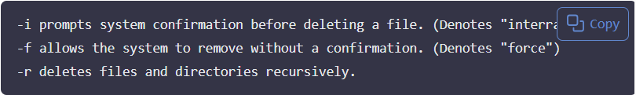

**Touch** command

The touch command allows you to create an empty file or update the timestamp of an existing file. The syntax is `touch [options] file_name`. For example, to create a new file named **'newfile.txt'**, you would use: `touch newfile.txt`
To create a new file, simply type `touch` followed by the desired file name. For example, to create a file named **'example.txt'**, you would use: `touch example.txt`

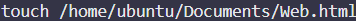

**find command**

The **'find'** command is used to search for files and directories in a specified location. It can search based on various criteria, such as name, size, type, and more. The syntax is `find [path] [options] [expression]`. For example, to find all files named **'example.txt'** in the current directory and its subdirectories, you would use: `find . -name "example.txt"`Here is the syntax for the `find` command:

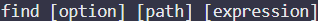

For example, to find all files with the `.txt` extension in the current directory and its subdirectories, you would use: `find . -name "*.txt"`If you want to search for files in a specific directory, you can specify the path. For example, to find all files named **'example.txt'** in the **'/home/username/Documents'** directory, you would use: `find /home/username/Documents -name "example.txt"`If you want to look for a file called 'notes.txt' within the home directory and its subfolders, you can use the following command:

