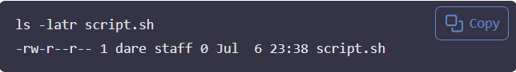

**Mini Project - Advanced Linux Commands**

**Advanced Linux Commands**

**File Permissions and Access Rights**

Understanding how to manage file permissions and ownership is crucial in Linux. This knowledge empowers you to control access to files and directories, ensuring the security and integrity of your system. Let's explore some essential commands and concepts related to file permissions and ownership.

In Linux, managing file permissions and ownership is vital for controlling who can access, modify or execute files and directories. Understanding these concepts allows you to maintain system security and integrity. Here are some key commands and concepts:

1. **File Permissions**: Linux file permissions are divided into three categories: owner, group, and others. Each category can have read (r), write (w), and execute (x) permissions.

2. **Changing Permissions**: The `chmod` command is used to change file permissions. You can use symbolic (e.g., `chmod u+x file.txt`) or numeric (e.g., `chmod 755 file.txt`) modes to set permissions.

3. **File Ownership**: Each file is owned by a user and a group. The `chown` command allows you to change the owner and group of a file (e.g., `chown user:group file.txt`).

4. **Viewing Permissions**: The `ls -l` command displays file permissions, ownership, and other details in a long format.

5. **Access Control Lists (ACLs)**: ACLs provide a more granular level of permission control. You can use the `setfacl` and `getfacl` commands to manage ACLs.

By mastering these commands and concepts, you can effectively manage file permissions and ownership in Linux, enhancing your system's security and functionality.

Let's delve into the key commands and concepts related to file permissions and ownership.

**Numeric Representation of Permissions**

In Linux, permissions are represented using numeric values. Each permission **(no permission, read, write, and execute)** is assigned a numeric value:

  *no permission = 0*
    *read = 4*
    *write = 2*
    *execute = 1*

These values are combined to represent the permissions for each user class. Lets consider few examples:

 **Permissions Represented by 7**

**4(read) + 2(write) + 1(execute) = 7**

Symbolic Representation of Permissions

In addition to numeric representation, Linux also supports symbolic representation of permissions. Symbolic representation uses letters to represent the different permission types:

* `r` for read
* `w` for write* `x` for execute

Symbolic representation allows you to modify permissions more intuitively. For example, to add execute permission for the user, you can use the following command:

chmod u+x file.txt

This command adds (`+`) execute permission (`x`) for the user (`u`) on `file.txt`. Similarly, you can remove permissions using `-` and set exact permissions using `=`.

chmod u-r file.txt  # Remove read permission for user
chmod g=rw file.txt  # Set read and write permissions for group

Understanding both numeric and symbolic representations of permissions is essential for effective file management in Linux.

**Symbolic: rwx**
Meaning : Read, write, and execute permissions are all granted.
**Example Context: A script file that the owner needs to read, modify, and execute.**

**Permissions Represented by 5**

4(read) + 0(no permission) + 1(execute) = 5
**Symbolic:r-x**
Meaning :Read and execute permissions are granted, but write permission is not.
**Example Context: A directory that the user needs to access and list files in, but not modify.**A shared library or a command tool that users can execute and read but not modify.

**Permissions Represented by 6**

4(read) + 2(write) + 0(no permission) = 6

**Symbolic: rw-**
Meaning : Read and write permissions are granted, but execute permission is not.
**Example Context: A configuration file that the owner needs to read and modify, but not execute.**
A text document that the user needs to read and edit, but not execute.

**Shorthand Representation of Permissions**

In addition to the numeric way of showing permissions, Linux also has a shorthand, or symbolic, method of representing file permissions.

**Understanding User Classes from a Permissions Perspective**

Before diving into shorthand permissions, it's important to understand the concept of "user classes " in the context of Linux permissions. Think of user classes as categories of users that Linux recognizes when deciding who can do what with a file or directory. There are three primary user classes:

**Owner**:The person who created the file or directory. This user has the highest level of control over the file and can set permissions for others.

**Group**:A collection of users who share certain permissions. The group can be assigned specific permissions for a file or directory, allowing members of the group to access or modify it based on those settings.

**Others**:All other users on the system who are not the owner or part of the group. Permissions for others are typically more restrictive, as these users do not have a specific relationship with the file or directory.

**The Role of Hyphens (-) in Permission Representation**

When discussing permissions, you might notice hyphens (-) being mentioned. In the context of Linux file permissions, a hyphen doesn't actually present a permission; instead, it indicates the absence of a specific permission. For example, if you see `r--`, it means that read permission is granted, but write and execute permissions are not.

Lets get a bit practical with examples. Get onto your Linux terminal and run **ls -latr** command to see the permissions of files and directories in the current directory. You will see something like this:

Let's break down to understand what each part means:

. In the output above, you will notice that some of the first character can be a - or **d**: **d** means it's a directory, - means it's a file.

. The next three characters (rwx) show the permissions for the owner. r stands for read, w for write, and x for execute.

. If a permission is not granted, it is represented by a hyphen (-). For example, if you see `r--`, it means that read permission is granted, but write and execute permissions are not.e.g., r-x means read and execute permissions are granted, but write permission is not.

. The hyphen separates, owner, group, and others

The following three characters after the owner's permissions represent the group's permissions, using the same r,w, and  x notation.

. The last three characters represent the permissions for others, again using the same r,w, and  x notation.

The order the user class is represented is as follow;

. The first hyphen "-" is the **owner/user**

    
. The second hyphen "-"is the **group**

. The third hyphen "-" is the **others** 

**File Permission Commands**

To manage file permissions and ownership, Linux provides several commands:

**chmod command**
The 'chmod' command allows you to modify file permissions. You can use it in two ways: symbolic mode and numeric mode/representations to assign permissions to the user, group, and others.

Lets see an example.

Create an empty file using the **'touch** command:

Check the permission of the file

**What do you think the permission of the above output represent?**

Now lets update the permission so that all the user classes will have execute permission.

The above command adds execute permission for all user classes (owner, group, and others) to the file named `script.sh`. The `+x` option specifies that execute permission should be added. The `script.sh` is the name of the file to which the permission change is applied.

The above command uses the chmod command with the '+x' option to grant execute permission to the file **'script.sh'**. The '+x' option adds the execute permission to the existing permissions for all the user classes.

Now lets check what the file permissions look like

The output `-rwxr-xr-x` indicates the following permissions for the file `script.sh`:

- The owner has read, write, and execute permissions (rwx).
- The group has read and execute permissions (r-x).
- Others have read and execute permissions (r-x).

This means that the owner of the file can read, modify, and execute it, while members of the group and other users can only read and execute the file but cannot modify it.

The same command can be executed to achieve the same result using the numbers approach.

The command `chmod 755 script.sh` sets the permissions for the file `script.sh` using numeric representation. The number `755` is broken down as follows:

- The first digit `7` represents the owner's permissions, which include read (4), write (2), and execute (1) permissions. Adding these values together gives 7 (4+2+1).
- The second digit `5` represents the group's permissions, which include read (4) and execute (1) permissions. Adding these values together gives 5 (4+0+1).
- The third digit `5` represents the permissions for others, which also include read (4) and execute (1) permissions. Adding these values together gives 5 (4+0+1).

- (4+2+1) =7 for the user (read, write, execute)

- (4+1) =5 for the group (read and execute)

Let's consider another example. Imagine the owner of a file is currently the only one with full permissions to **'note.txt'**.

To allow group members and others to read, write and execute the file, change it to the following: `chmod 777 note.txt` which isw written as **-rwxrwxrwx**permission type, whose numeric value is 777.

chmod 777 note.txt

Check the output

Now , notice the dash**(-)** at the beginning of the permission string. This indicates that it is a regular file. If it were a directory, the permission string would start with a **d**.The dash**(-)** in the first position  represents the file type and not a permission.or user class. It indicates that the item is a regular file. If it were a directory, the first character would be a **d** instead of a dash.

**chown** command

The chown command allows you to change the ownership of files, directories, or symbolic links to a specified username or group name.

Here's the basic format:

For example,lets assume there is a user on the server called **'john'**, a group on the server called **"developers"** and you want the owner of **'filename.txt'** changed from **dare** to **john**, and to also ensure that any user in the developer group has ownership of the file as well:

The command would look like this:

chown john:developers filename.
txt

Check the output with **'ls -latr'** command on this file to then see the new changes.

**Superuser Privileges with sudo**

It is necessary to become the superuser to perform certain administrative tasks, such as changing file ownership or modifying system files. The `sudo` command allows a permitted user to execute a command as the superuser or another user, as specified by the security policy.It is often necessary to become the superuser to perform important tasks in linux, but as we know, we should not stay logged in as the superuser. In most linux distributions, there is a command that can give you temporary access to the superuser's privileges. This program is called sudo, which stands for "superuser do". and can be used in those cases when you need to be the superuser for a small number of tasks. To use the superuser privileges, simply type sudo before the command you want to invoke/run with superuser privileges. For example, to change the ownership of a file using chown, you would use:**sudo chown john:developers filename.txt**

To switch to the root user, simply run

You can type **exit** to return to your normal user or to leave the terminal or shell.

**User Management on Linux**

As a DevOps engineer, you are also going to be doing systems administration tasks, which includes user management. Linux provides several commands to manage users and groups effectively. Here are some essential commands for user management:

- `useradd`: Create a new user.
- `usermod`: Modify an existing user.
- `userdel`: Delete a user.
- `passwd`: Change a user's password.
- `chage`: Change user password expiry information.
- `groupadd`: Create a new group.
- `groupmod`: Modify an existing group.
- `groupdel`: Delete a group.
System Administration involves managing different users on the servers. You should know how to create a new user, or group, modify their permissions, update password and such similar tasks.

**Creating a User**

To create a new user on ubuntu server, you can use the **adduser** command. Assuming the name of the user to be created is **joe**. Open the terminal and run the following command:

sudo adduser joe

running this command will prompt you to enter and confirm a password for the new user. You will also be asked to provide some additional information about the user, such as their full name, room number, work phone, home phone, and other details. You can choose to fill in this information or leave it blank by pressing Enter.Once you provide the necessary information, the user account will be created and a home directory will be automatically generated for the user. i.e.the system will create the new user account with the specified username and password.

The home directory represents a file system created in the name of the user. Such as **/home/joe**. This is the default location where the user's personal files and settings created on the server will store their respective data.

**Granting Administrative Privileges to a User**

By default, newly created user accounts do not have administrative privileges. To grant a user administrative privileges, you can add them to the `sudo` group. This allows the user to execute commands with superuser privileges using the `sudo` command.To grant administrative access to a user, you can add the user to the sudo group. Users in the sudo group can run commands with administrative privileges by prefixing them with sudo. For example, to add the user **joedoe** to the sudo group, you would run the following command:

sudo usermod -aG sudo joedoe

**-usermod**: This command is used to modify a user account.

**-aG**: These options are used together to append the user to a group without removing them from other groups. `-a` stands for append, and `-G` specifies the group to which the user should be added.

- -a stands for **append** and is used to add the user to the specified group without removing them from any other groups they may already be a member of.

- -G stands for ** supplementary group** and its followed by a comma-separated list of groups and is used to specify the group to which the user should be added.It specifies the group to which the user should be added or modified

- In the given command, **-aG sudo** is used to add the user **johndoe** to the **sudo** group, granting them administrative privileges.

The sudo group is typically associated with administrative or superuser privileges. By adding **johndoe** to the to the sudo
group.

- The sudo group is typically associated with administrative or superuser
privileges. By adding **johndoe** to the sudo group, the user gains the ability to execute commands with elevated privileges. You are granting them the ability to execute commands with elevated privileges using the sudo command. The sudo command allows users to run programs with the security privileges of another user, typically the superuser or root.

**Switching User Accounts**

To start using the system as another user, you will need to use the **su** command to switch, which stands for "substitute user" or "switch user". The basic syntax of the command is as follows:su [username]

For example, to switch to the user account named **johnjoe**, you would run the following command:
su joe

You will be prompted to enter the password for the user. Once authenticated, you will switch to the user's environment and have access to their files and permissions. To return to your previous user account, simply type **exit** and press Enter.

**Modifying Use Accounts**

*Changing User Password*

To change the password for a user, use the *passwd* command followed by the username. For example, to change the password for the user **johnjoe**, run the following command:

sudo passwd joe

You will be prompted to enter a new password for the user and confirm it by typing it again. Once the password is successfully changed, you will see a message indicating that the password has been updated.

**Creating a Group**

To create a new group, use the **groupadd** command followed by the group name. For example, to create a group named **developers**, run the following command:
sudo groupadd developers

**Adding Users to the Group**

To add a user to a group, use the **usermod** command with the **-aG** option. For example, to add the user **johnjoe** to the **developers** group, run the following command:

sudo usermod -aG developers johnjoe

-The **-aG** option is used to append the user to the specified group without removing them from any other groups they may already be a member of. `-a` stands for append, and `-G` specifies the group to which the user should be added.

**Verying Group Membership**

To confirm the group membership for a specificuser, use the **id** command followed by the username. For example, to check the group membership for the user **johnjoe**, run the following command:
id johnjoe

This command displays information about the user **johnjoe**, including the groups they belong to, such as **developers**.

**Deleting a User**

To delete a user, run the command below

sudo userdel username

**Ensuring Proper Group Permissions**

Groups in Linux are often used to manage permissions for files and directories. Ensure that the relevant files or directories have the approriate group ownership and permissions. For example, to grant the **developers** group ownership of a directory

sudo chown -R :developers /path/to/directory

And to grant read and write permissions to the group:

