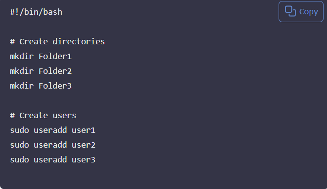
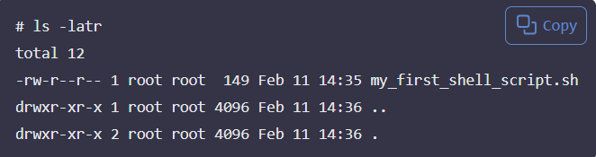
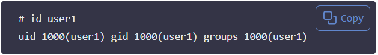
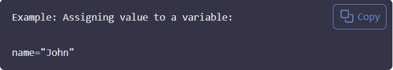
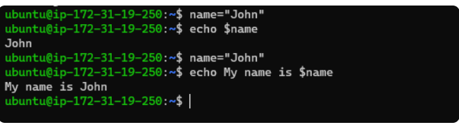

# Mini Project- Linux Shell Scripting #

## SHELL SCRIPTING ##

With the thousands of commands available to the command line user, how can we remember them all? The answer is, we don't. The real power of the computer is its ability to do the work for us. To get it to do that, we use the power of the shell to automate things. We write shell scripts.

## What is Shell Scripting ##

Imagine you are tasked with setting up new workstations and user accounts regularly at your job. Instead of manually creating each folder and user account, a simple shell script serves as your efficient digital helper. By automating the creation of multiple directories and user accounts with just a few lines of code, it saves you considerable time and effort, allowing you to focus on more critical aspect of your work or tasks.

A shell script is a text file that contains a sequence of commands for a UNIX-based operating system's shell to execute. It allows users to automate repetitive tasks, manage system operations, and streamline workflows by combining multiple commands into a single executable file.

## Why Use Shell Scripting? ##

1. **Automation**: Shell scripts can automate repetitive tasks, saving time and reducing the chance of human error.
2. **Efficiency**: By combining multiple commands into a single script, users can execute complex tasks with a single command, improving overall efficiency.
3. **Consistency**: Scripts ensure that tasks are performed consistently and correctly every time they are run.
4. **Scheduling**: Shell scripts can be scheduled to run at specific times or intervals using cron jobs, allowing for unattended automation.
5. **Customization**: Users can create scripts tailored to their specific needs, making it easy to adapt to changing requirements.
6. **Learning Tool**: Writing shell scripts helps users learn more about the command line and system administration.

## Basic Structure of a Shell Script ##

A shell script typically consists of the following components:

1. **Shebang**: The first line of a script often starts with `#!/bin/bash` (or another shell path), indicating the script's interpreter.
2. **Comments**: Lines beginning with `#` are comments and are ignored by the shell. They are used to explain the script's purpose and functionality.
3. **Commands**: The main body of the script contains a series of commands to be executed. These can include built-in shell commands, external programs, and control structures (e.g., loops, conditionals).
4. **Variables**: Shell scripts can use variables to store and manipulate data. Variables are defined using the syntax `variable_name=value` and accessed with `$variable_name`.
5. **Control Structures**: Scripts can include control structures like `if` statements, `for` loops, and `while` loops to control the flow of execution.

Here's a simple example of a shell script:


#!/bin/bash

# This is a comment
echo "Hello, World!"

# Define a variable
name="Alice"
echo "Hello, $name!"

# Control structure
if [ "$name" == "Alice" ]; then
  echo "Welcome, Alice!"
else
  echo "Who are you?"


Shell scripting is the process of writing scripts for the shell to automate tasks and manage system operations efficiently. By mastering shell scripting, users can enhance their productivity and streamline their workflows in a UNIX-based environment.

Shell scripting is the process of writing and executing a series of instructions in a shell to automate tasks and manage system operations efficiently. A shell script is essentially a script or program written in a shell language, such as Bash, that contains a sequence of commands to be executed by the shell.sh,zsh, or PowerShell.

A basic shell script that will create multiple folders and create multiple linux users at once would look like this:

Shell Script Example](./images/shell_script_example.png)

Task for you:

1. Create a folder on an ubuntu server and name it shell -scripting

2. Using the *vim* editor, create a file called my_first_shell_script.sh inside the shell-scripting folder.

3. Put the shell script code above into the new file

4. Save  the file and exit the vim editor.

5. Use *cd* command to change into the *shell-scripting* directory.

6. Use *ls-latr* command to confirm that the file is indeed created.

You should have something like this



Something you should notice about the permissions of the newly created file is this *-rw-r--r--*. This means that the file is not yet executable. To make it executable, you need to change its permissions using the *chmod* command.

1.The owner of the file has read (r) and write (w) permissions.

2. Members of the file's group have read *(r)* permission only.

3. Others also have read *(r)* permission only.

However, no one has the execute permission *(x)* yet, which is necessary to run the script. To add execute permission for the owner, you can use the following command:

```bash
chmod u+x my_first_shell_script.sh
```

This command modifies the file's permissions, allowing the owner to execute the script.

To execute the script, you can use the following command:


 *./my_first_shell_script.sh

 * ./ This prefix to the file indicates that the command should look for the file in the current directory.

 * The dot (.) represents the current directory.
* and the slash (/) is a directory separator that separates the directory from the file name.

when you hit enter, you should get a response like this:


Notice that we now have a *Permissions denied* error which can easily be resolved by giving the file the necessary permission it requires.

But, did you also notice the mention of *"bash"* at the beginning of the error message? This is because the script is intended to be run using the Bash shell. If you want to run the script without changing its permissions, you can explicitly invoke the Bash shell to execute it. You can do this by using the following command:

bash
bash my_first_shell_script.sh

Notice that when you run the script using the *bash* command, it executes successfully, and you see the expected output. You notice the mention of *"bash"* at the beginning of the error message because you are explicitly telling the system to use the Bash shell to run the script, which has the necessary permissions to execute it.It indicates that the error message is coming from the Bash shell itself.Bash is a command interpreter or shell that you're using in the terminal to execute commands. We will talk more about this in the next section.

Task for you:

1. Add the execute permission for the **owner** to be able to run or execute the script using the *chmod* command as shown above.

2. Run the shell script again using the *./my_first_shell_script.sh* command.

3. Evaluate the output of the script and ensure that it runs without any permission errors.Ensure the 3 folders are created.

Evaluate and ensure that the 3 users are created  on linux server by running the following command:
cat /etc/passwd | grep user

Hint to learn more about Shell Scripting? Explore the following resources:1. [Shell Scripting Tutorial for Beginners](https://www.shellscript.sh/)
2. [Bash Scripting Guide](https://tldp.org/LDP/Bash-Beginners-Guide/html/)
3. [Advanced Bash-Scripting Guide](https://tldp.org/LDP/abs/html/)
4. [Linux Shell Scripting Tutorial](https://www.geeksforgeeks.org/linux-shell-scripting-tutorial/)

Hint

1. Use the **chmod** command to change or update file permissions and make the script executable.

2. Use **ls** to test that the folders are created and to check file permissions before and after using chmod

3. Use **cat /etc/passwd | grep user** to verify that the users are created on the linux server.

4. Use **id** command to test or check user information check that that the users are created. You should see something like this: 

id user1
uid=1001(user1) gid=1001(user1) groups=1001(user1)


## What is a Shebang (#!/bin/bash)? ##

A shebang (also called a hashbang) is the character sequence `#!` followed by the path to an interpreter. It is used at the beginning of a script file to specify which interpreter should be used to execute the script.
For example, in a Bash script, the shebang line is typically `#!/bin/bash`, indicating that the script should be run using the Bash shell. When you execute the script, the operating system uses the specified interpreter to run the commands within the script.
#!/bin/bash

Notice that, at the beginning of the shell script, we have the shebang line `#!/bin/bash`. This is what is called **shebang**. It is a special notation used in unix-like operating systems like Linux, to specify the interpreter that should be used to execute the script. In this case, **#!/bin/bash** specifically indicates that the **Bash** shell should be used to interprete and execute the script.
This line tells the operating system to use the Bash shell to interpret and execute the commands in the script. It ensures that the script runs in the correct environment, regardless of the user's default shell.

You can explore the /**bin** folder and see the different programs in there using the commands here:
ls /bin
or
ls -l /bin
**bash** is one of them which is used as the interpreter in that script. If we wanted to use another shell like **sh**, the shebang would be updated to **#!/bin/sh**. **bash** is usually located in the **/bin** directory, which is a standard location for essential command-line utilities and programs in Unix-like operating systems.
**bash** is one of them which is used as the interpreter in that script. If we wanted to use another shell like **sh**, the shebang would be updated to **#!/bin/sh**.
**/bin/bash**: This is the absolute path to the Bash shell executable. It tells the system to use the Bash interpreter located at**bin/bash ** to run the script.

Without a shebang line, the system may not know how to interprete and execute the script, and you may need to explicitly specify the interpreter when running the script.

## Variable Declaration and Initialization in Shell Scripting ##

In programming generally,not just shell scripting,**variables** are essential for creating dynamic and flexible programs.

Variables can store data of various types such as numbers, strings, and arrays. You can assign values to variables using the = operator, and access their values using the variable name preceeded by a $ sign.

Let's explore a few examples:



From the example above, **"John"** was assigned to the variable **"name"**.

Now that the variable is assigned, you may ask, how then can i use it?

**Retrieving value from the vatriable**

After assigning a value to a variable, as shown in the previous example where we assigned "John" to the variable name, you can retrieve and use the value stored in the variable by prefixing the variable name with a dollar sign ($). This tells the shell to substitute the variable with its value.You can utilize this variable in various ways in your script or program. One of the most straightforward methods to use or retrieve the value stored in a variable is by echoing it back to the console. This is fone using the **echo** command in shell scripting.


This command instructs the shell to print the value of name to your screen, which, in our case, is "John". When you run this command, you should see the output:
**John**



echo is a command used to print a text, variables or values. In this example, echo is used to print a variable which stores a value.

In the next shell scripting project, we will see how powerful we can automate tasks using variables in shell scripting/control flows.


