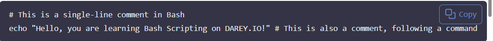
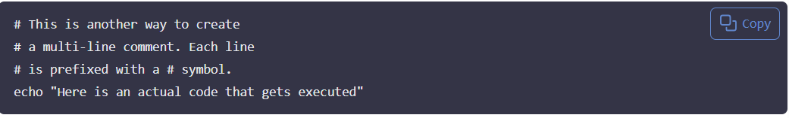

# Mini Project- Linux Shell Scripting (Comments) #

## Adding Comments in Bash Scripts ##

Comments are essential in programming, serving as notes to the programmer and anyone else who might read the code.

They explain what the script or parts of the script do, making it easier to understand and maintain. This section will guide you on how to add comments in Bash scripts.

## What Are Comments?##

Comments are lines in your code that are ignored by the interpreter. In Bash scripts, comment help document the purpose and logic of your code that are ignored by the interpreter. In Bash scripts, comments help document the purpose and logic of your code, making it easier for others (and yourself) to follow and understand the script's functionality.

## Single-Line Comments##

Single line comments in Bash start with the symbol `#`. Anything following this symbol on the same line is treated as a comment and is ignored during execution, its not executed as part of the script.



**Using Multiple Single-Line Comments:**



This approach is straightforward and is commonly used for adding brief descriptions, explanations, or notes spanning multiple lines within the script.

Best Practices for Commenting:

- **Clarity**: Write clear and concise comments that explsin the "why" behind the code, not just the "what".
- **Relevance**: Ensure comments are relevant to the code they describe and avoid stating the obvious.
- **Maintainability**: Keep comment updated as you modify the code to ensure they remain relevant and helpful.Update comments when the code changes to keep them accurate and useful.

- **Useflness**: Comment on complex or non-obvious parts of the script to provide insights into your thought process and decision-making. Focus on adding comments that provide value, such as explaining complex logic or decisions made in the code.

- **Consistency**: Follow a consistent style for writing comments throughout your script to enhance readability.

- **Avoid Over-Commenting**: While comments are helpful, avoid excessive commenting that can clutter the code and make it harder to read.Dont comment on every line of code, especially if the code is self-explanatory. Focus on parts that benefit from additional explanation.

At this stage, you've established a solid foundation in Bash/Shell scripting. (It's worth nothing that Bash and Shell are similar in functionality, which is why their names are often used interchangeably, despite being disctinct interpreters.)

Moving forward, you will embark on capstone project that provides an opportunity for hands on practice, allowing you to apply your scripting skills in a practical setting and truly immerse yourself in the coding experience. It gives experience in creating a comprehensive Bash script.  Capstone project will allow you to apply the concepts and techniques you've learned throughout the course, culminating in a practical demonstration of your scripting skills.


Comments are an essential part of any script, including Bash scripts. They help explain the code, making it easier to understand and maintain. In Bash scripts, comments are created using the `#` symbol. Anything following the `#` on that line is ignored by the shell.

### Example of Comments in a Bash Script ###

```bash
#!/bin/bash

# This is a comment
echo "Hello, World!"

# Define a variable
name="Alice"
echo "Hello, $name!"

# Control structure
if [ "$name" == "Alice" ]; then
  echo "Welcome, Alice!"
else
  echo "Who are you?"
fi
```

In this example, comments are used to explain each part of the script. They provide context and make it easier for someone else (or your future self) to understand the code.

### Best Practices for Writing Comments ###

1. **Be Clear and Concise**: Write comments that are easy to understand and get to the point quickly.
2. **Explain Why, Not What**: Focus on explaining why a particular approach was taken, rather than what the code is doing (which should be clear from the code itself).
3. **Keep Comments Up-to-Date**: If you change the code, make sure to update the comments accordingly.
4. **Use Comments to Document Assumptions**: If your code relies on certain assumptions, document them in comments.

By following these best practices, you can create well-documented Bash scripts that are easier to read and maintain.